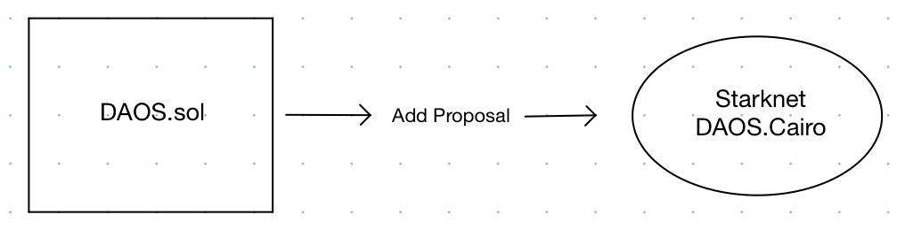
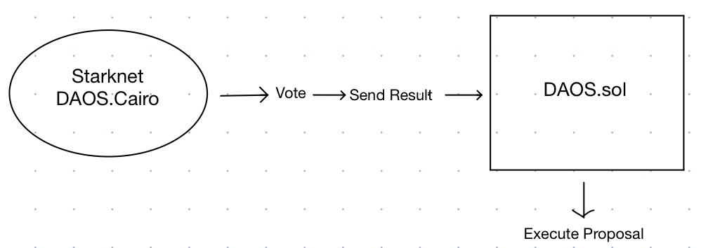

# DAOS
On-chain governance system for DAOs who want to manage their assets in Ethereum.

## How does it work?

### Publishing the Proposal
 <br>
The proposal is started on Ethereum and the information of the proposal is sent to the contract on Starknet.


### Voting and Sending the Result to Ethereum
 <br>
Since the transaction is cheap on Starknet, voting takes place and the result is sent to Ethereum.


## Contracts

```
contracts
├── cairo
│   └── contracts
│       └── DAO.cairo
│       └── DAOToken.cairo
│
└── solidity
    └── src
        └── DAOToken.cairo
        └── interfaces
            └── DAO.cairo
```

## TODO

- Contract for holders of tokens on Ethereum for DAOs to move their tokens to Starknet